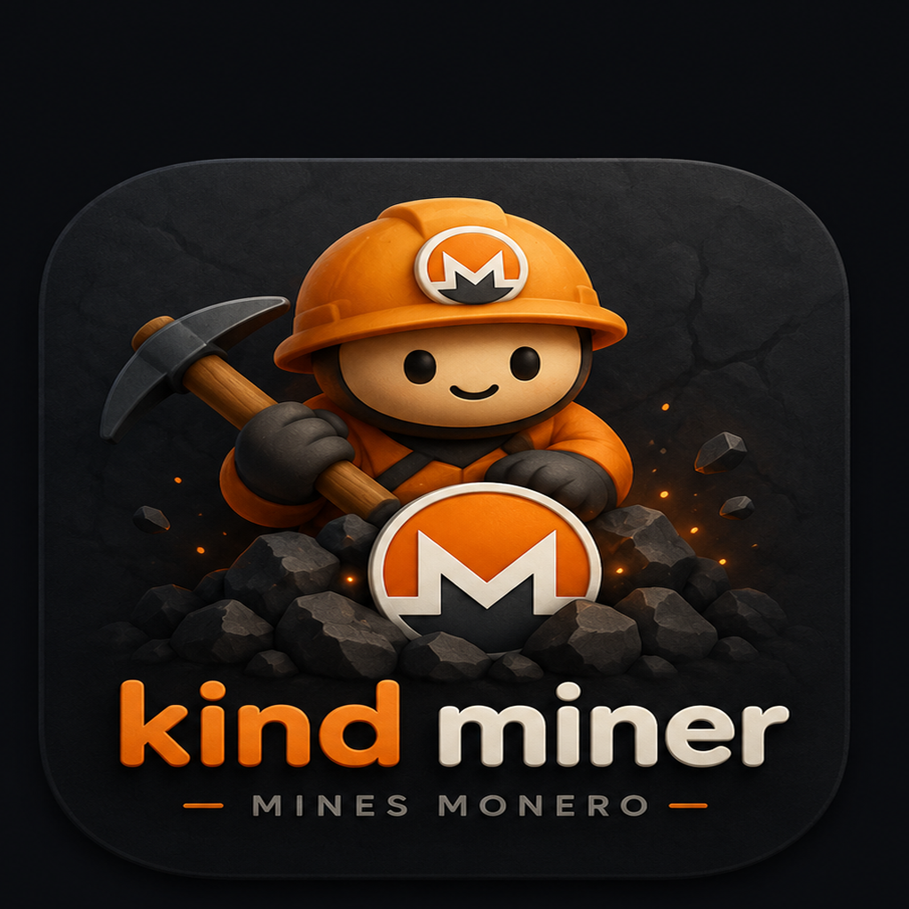

# kind-miner

**Idle Monero mining for always-on machines.**  
No account. No pool operator. No fee. Your coins go directly to your wallet.

---

## The premise

Your desktop is already on. The CPU is already drawing power. Those cycles are going nowhere — a modern machine at idle burns 60–120 W regardless of whether it's doing useful work or not.

Monero is one of the last coins where CPU mining is meaningful. RandomX was designed specifically to resist ASICs and favour commodity hardware. A single desktop at home running kind-miner puts real hashrate onto a network that needs it — and does so in a way that is private by default, trustless from end to end, and completely invisible when you actually need your machine.

[P2Pool](https://p2pool.io) changed the economics. Before P2Pool, solo mining was a lottery with months between wins; pools required accounts and took fees. P2Pool is a sidechain on top of Monero: your miner works on the P2Pool sharechain, and when any P2Pool miner finds a Monero block, every participant gets a proportional payout **directly from the coinbase output**. There is no pool wallet. No payout threshold. No operator who knows your address. Your coins arrive in your wallet exactly like solo-mined coins — they just arrive more often.

Kind-miner connects your machine to this infrastructure over Tor. The node doesn't see your IP. The sidechain pays you directly. Nobody in the pipeline knows who you are.

---

## Features

- **Disappears under load.** Every 5 seconds the scheduler measures your CPU usage, excluding the miner's own threads. If you start compiling, gaming, or rendering, XMRig is throttled or suspended within one tick. When you stop, it resumes automatically.
- **Four-gear state machine.** Full → Reduced (half threads) → Minimal (1 thread) → Paused. Transitions are smooth and fast (~500 ms for a thread count change).
- **Temperature ceiling.** Configurable hard limit; mining suspends if any core exceeds it.
- **Battery awareness.** Pauses automatically when unplugged. Resumes on AC.
- **Tor-native.** Routes through a Tor hidden service by default. Your IP is not visible to the node operator.
- **Zero-setup dependencies.** XMRig and P2Pool are downloaded automatically on first run (SHA256-verified). You need: a Monero wallet address, and Tor running.
- **Graphical or terminal.** Double-click for a full window — onboarding, live status, pause/resume, and an in-app settings panel — that tucks into the system tray while it mines. Launched from a terminal it behaves as it always has: a tray icon and logs on stdout.
- **Single native binary.** No installer, no runtime, no Python, no Electron. `./kind-miner` and you're done.

---

## Prerequisites

| Requirement | Notes |
|---|---|
| **Tor** | Must be running at `127.0.0.1:9050`. Kind-miner will attempt to start it automatically if not running. |
| **A Monero wallet address** | Any wallet that gives you a standard address (starts with `4`). [Feather](https://featherwallet.org) is recommended — it also runs over Tor. |
| Linux, macOS, or Windows | Linux is the primary target; macOS and Windows work but are less tested. |

**To install and start Tor:**
```sh
# Debian / Ubuntu / Mint
sudo apt install tor
sudo systemctl enable --now tor

# Fedora / RHEL
sudo dnf install tor
sudo systemctl enable --now tor

# Arch
sudo pacman -S tor
sudo systemctl enable --now tor

# macOS
brew install tor && brew services start tor
```

To confirm Tor is running: `systemctl is-active tor` should print `active`.

---

## Quick start

```sh
# Download the latest release for your platform from:
# https://codeberg.org/dMartian/kind-miner/releases

# Make executable (Linux/macOS)
chmod +x kind-miner

# Double-click the app, or run it from a terminal:
./kind-miner
#   • From a desktop (double-click / .desktop): opens the full GUI window.
#   • From a terminal: shows a system-tray icon and logs to stdout.

# Force the graphical window, even from a terminal:
./kind-miner --gui

# Headless — no GUI at all, logs to stdout (servers, SSH):
./kind-miner --no-tray        # --headless is an alias
```

On first run with no config file, kind-miner collects your wallet address — through a graphical onboarding window when launched from the desktop, or a short text wizard when launched from a terminal — then writes `~/.config/kind-miner/config.yaml` and starts mining. A headless launch with no display writes a config template for you to edit instead.

---

## Keeping your machine awake

Kind-miner only mines when the machine is on. Most operating systems will suspend the machine automatically after a period of inactivity — when that happens, mining stops until you wake it up.

To mine overnight or continuously, turn off automatic sleep:

**Linux — GNOME**  
Settings → Power → Automatic Suspend → set to **Off**

**Linux — KDE Plasma**  
System Settings → Power Management → Energy Saving → uncheck **Suspend session**

**Linux — command line**
```sh
sudo systemctl mask sleep.target suspend.target hibernate.target hybrid-sleep.target
```

**macOS**  
System Settings → Battery (or Energy Saver) → set **Turn display off after** to **Never**, and enable **Prevent automatic sleeping when the display is off**

**Windows**  
Control Panel → Power Options → Change plan settings → set **Put the computer to sleep** to **Never**

---

## Configuration

Config lives at `~/.config/kind-miner/config.yaml` (Linux/macOS) or `%APPDATA%\kind-miner\config.yaml` (Windows).

```yaml
# Your Monero wallet address. Required.
wallet: "4..."

# Connection mode: p2pool-remote | p2pool-local | pool
mode: p2pool-remote

# p2pool-remote: which monerod node p2pool connects to.
# Leave blank to use the kind-miner Nodo (Tor, ZMQ confirmed).
remote_node: ""

# P2Pool sidechain: "mini" for hashrate < 50 kH/s (most desktops),
# "main" for higher hashrate machines.
p2pool_chain: mini

# Set to true to let kind-miner manage the p2pool subprocess.
manage_p2pool: true

# Traditional pool URL — only used when mode: pool.
pool_url: ""

# Maximum XMRig threads. 0 = half of logical cores (recommended).
max_threads: 0

# How aggressively to yield to other processes.
# low:    reduce at 70% CPU, pause at 80%
# medium: reduce at 40% CPU, pause at 60%  ← default
# high:   reduce at 20% CPU, pause at 40%
throttle_sensitivity: medium

# Pause when running on battery.
pause_on_battery: true

# Pause if any CPU core exceeds this temperature (Celsius).
temp_limit_celsius: 95

log_level: info
```

---

## Connection modes

### `p2pool-remote` (default)

```
XMRig → p2pool (local) ──Tor──→ monerod Nodo (.onion) → Monero network
```

P2Pool runs on your machine. It connects to the kind-miner Nodo — a dedicated Monero full node running as a Tor hidden service, with ZMQ enabled for p2pool. Your IP is not exposed to the node. Payouts arrive directly in your wallet from the P2Pool sharechain. No fee.

**Requires:** Tor running at `127.0.0.1:9050`.

### `p2pool-local`

```
XMRig → p2pool (local) → monerod (local) → Monero network
```

You run your own `monerod` locally. Maximum trustlessness — you validate every block yourself. Requires ~180 GB of disk space and 1–3 days for initial sync.

Set `manage_monerod: true` to have kind-miner start and stop `monerod` for you.

### `pool`

```
XMRig → pool (Stratum) → Monero network
```

XMRig connects directly to a Stratum pool. Simpler, but the pool operator knows your wallet address, takes a fee (typically 0.6–1%), and controls payouts. Suitable for machines where your hashrate is too low for P2Pool shares to arrive in reasonable time.

---

## How the scheduler works

```
every 5 seconds:
  cpu_usage = total_cpu% - xmrig_cpu%    ← other processes only

  if cpu_usage > pause_threshold  → pause XMRig (SIGSTOP)
  elif cpu_usage > reduce_threshold → half threads
  else                              → full threads

  if battery and pause_on_battery  → pause
  if any_core_temp > limit         → pause
```

XMRig runs at OS idle priority (`nice 19` on Linux/macOS, `IDLE_PRIORITY_CLASS` on Windows). The scheduler is a second, independent layer on top of that. The combination means the miner loses scheduler fights to anything — including background browser tabs — and then gets explicitly suspended if system load climbs further.

The tray icon reflects state in real time:

| Icon | State | Meaning |
|---|---|---|
| 🟠 colour | Full / Reduced / Minimal | Mining at some thread count |
| ⚫ grey | Paused | Suspended — load, battery, or temp |

---

## Privacy model

| Layer | What it protects |
|---|---|
| **Monero** | Transaction amounts, sender, receiver hidden by default via RingCT + stealth addresses. No transaction graph. Coins are fungible. |
| **P2Pool** | The pool operator does not exist. Payouts come from the Monero protocol directly. No operator knows your wallet address or hashrate contribution. |
| **Tor** | The node operator does not see your IP. Your mining activity is not linkable to your network location. |
| **kind-miner** | No telemetry, no analytics, no update pings, no account, no registration. The binary talks to one place: the node, over Tor. |

If you use `p2pool-remote` (the default), the only party who sees anything about you is P2Pool's public sharechain — which shows that *someone* with *some* hashrate submitted a share. Your wallet address appears in the coinbase output of blocks you help find, exactly as it would if you solo-mined.

---

## Building from source

```sh
git clone https://github.com/kind-miner/kind-miner
cd kind-miner
go build -o kind-miner ./cmd/kind-miner
```

Requires Go 1.25+. The GUI uses [Fyne](https://fyne.io), which builds with cgo and
OpenGL, so the build host needs the GL/X11/Wayland development headers. On Fedora:

```sh
sudo dnf install gcc libXxf86vm-devel libX11-devel libXcursor-devel \
                 libXrandr-devel libXinerama-devel libXi-devel \
                 mesa-libGL-devel libxkbcommon-devel wayland-devel
```

(On Debian/Ubuntu the equivalents are `libgl1-mesa-dev xorg-dev libxxf86vm-dev
libxkbcommon-dev`.) The tray icons are embedded statically — no assets need to be
shipped alongside the binary.

```sh
# Run tests
go test ./...
```

---

## The Nodo

The default remote node is a dedicated Monero full node (the "Nodo") running as a Tor hidden service:

```
44yfclfdry66bbpyolux6xmfkcapage7khfk5sax7xmmylwwmjaqukad.onion
RPC  18089   ZMQ  18083
```

It runs `monerod` with ZMQ enabled — a requirement for p2pool that most public nodes skip. It is the only node in kind-miner's default list because we don't advertise nodes we can't verify. If it is temporarily unreachable, kind-miner retries automatically before giving up.

You can substitute any monerod node that has ZMQ enabled by setting `remote_node` in your config. If you run your own node on a home server, this is the cleanest option.

---

## Philosophy

Privacy is not a feature. It is the precondition for everything else.

Monero exists because surveillance of financial transactions is a form of control. A currency that leaks who paid whom, and how much, is a tool of that control regardless of who runs the nodes. Monero's default privacy means every user gets the same protection — there is no opt-in anonymity set of suspicious users, just one set of everyone.

P2Pool exists because mining centralization is an attack surface. A pool operator who controls the block template controls which transactions get confirmed. P2Pool removes the operator. Kind-miner defaults to P2Pool because that choice costs you nothing and contributes to a network that is harder to censor.

Tor is here because an IP address is metadata, and metadata has a way of becoming evidence.

None of this requires you to be doing anything interesting. The point is that the infrastructure exists and works, and that using it is free. Run the miner, collect some XMR, help keep the network decentralized, and go about your day.

---

## License

MIT. Do what you want with it.
